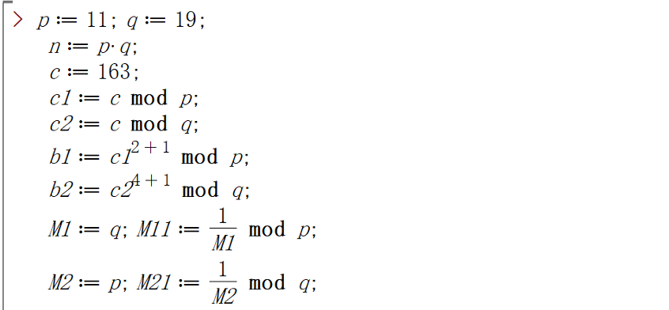
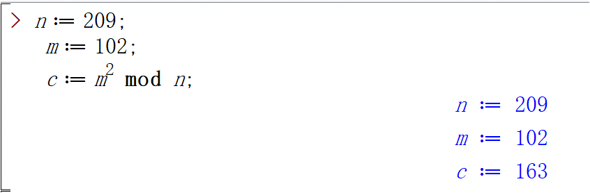
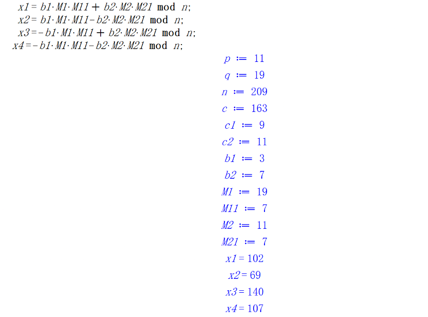
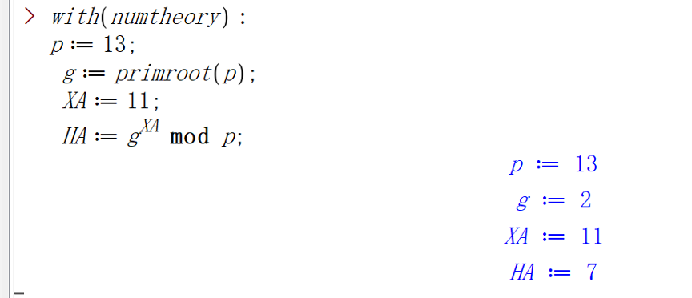
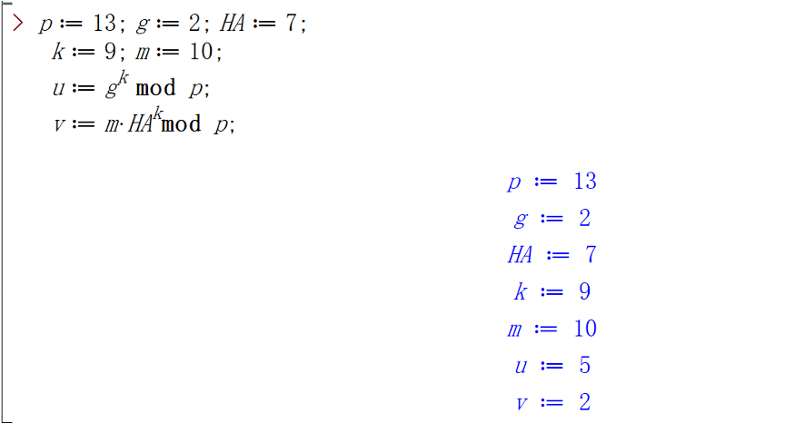
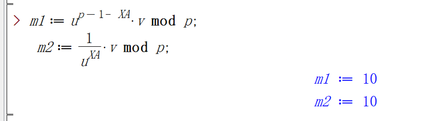

# Ex0

拉宾、ElGamal公钥加密解密

> 这个课程 答案正确与否 以及从何而来 一切都不重要了 有作业交就已经赢了

## 拉宾公钥加解密

用Maple协助进行拉宾密钥密码的求解

Alice要求Bob将信息m加密传送回.

(1) 密钥生成: Alice找到大素数p,q, 令n=pq, 然后将n 作为公钥发送给Bob, 这里p,q是私钥, 解密用.

(2) 加密: Bob将明文m分段使m<n,计算m2 ≡c (mod n), 并将密文c传送给 Alice.

(3) 解密: Alice收到后,求解 x2 ≡c (mod p), x2 ≡c(mod q), 得到解x ≡±b1(modp), x ≡ ± b2(mod q), 然后用孙子定理求得4解, 其中之一为明文m. 

## ElGamal椭圆曲线公钥加解密

Alice要求Bob将信息m加密传送回.

(1)密钥生成: Alice找到大素数p, p的原根a, 正整数XA, 1<XA<p, 计算h_A≡a^(X_A ) mod(p), 将p,a,hA作为公钥发送给Bob, 这里XA是私钥,解密用.

(2)加密: Bob将明文m分段使m<p,取k∈{1,2,···,p-1},计算u≡a^k mod(p),v≡〖h_A〗^k m mod(p),并将密文(u,v)传送给 Alice.

(3)解密: Alice收到后,  计算 〖vu〗^(-X_A )≡〖h_A〗^k m(a^k )^(-X_A )≡(a^(X_A ) )^k m(a^k )^(-X_A )≡m mod p, 恢复明文m.

