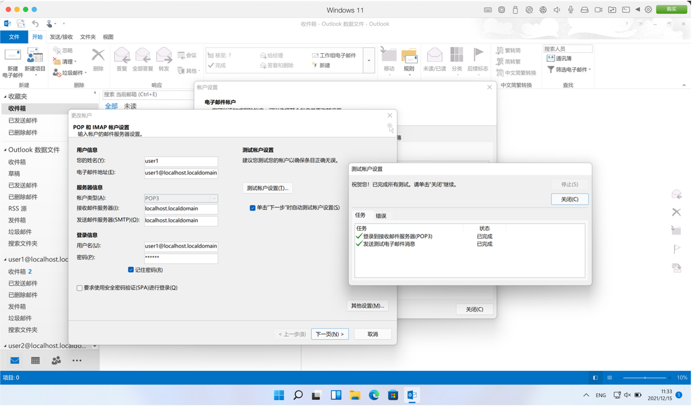
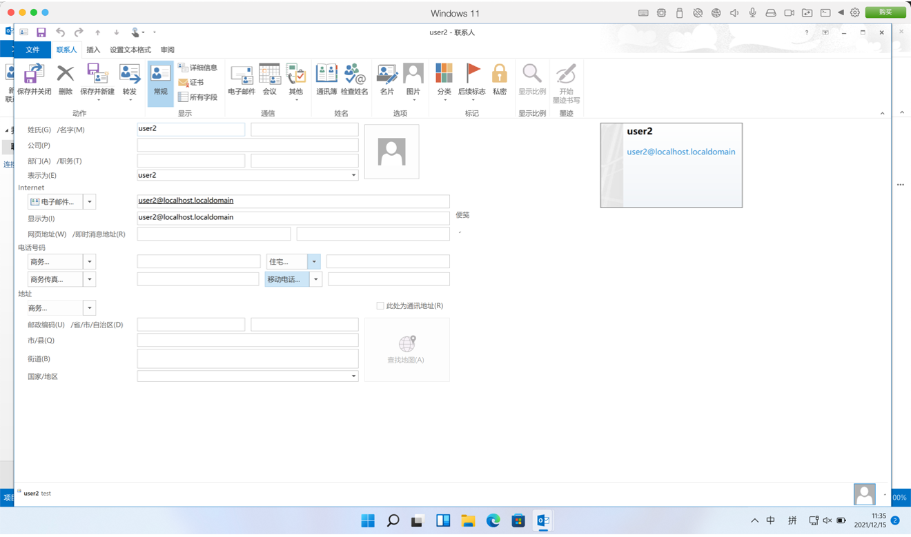
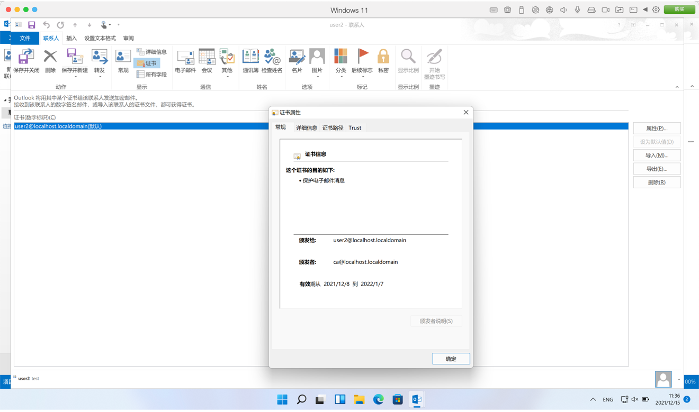
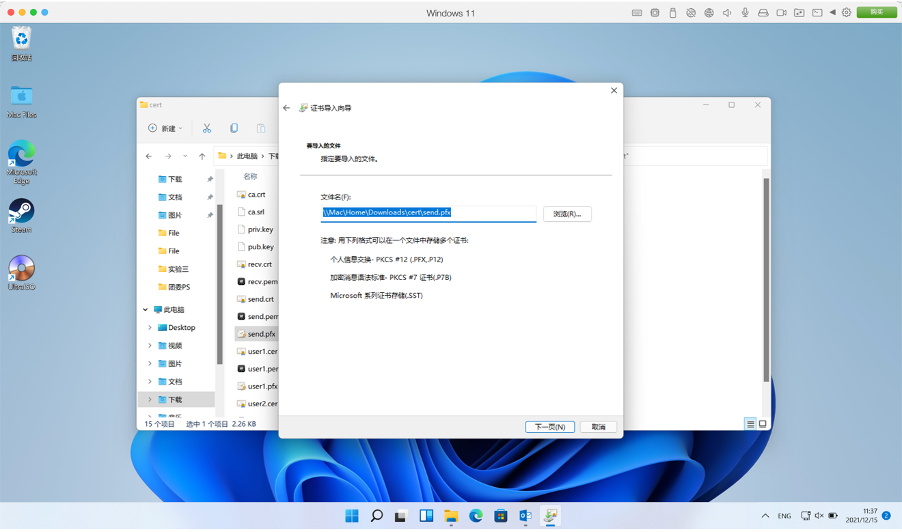
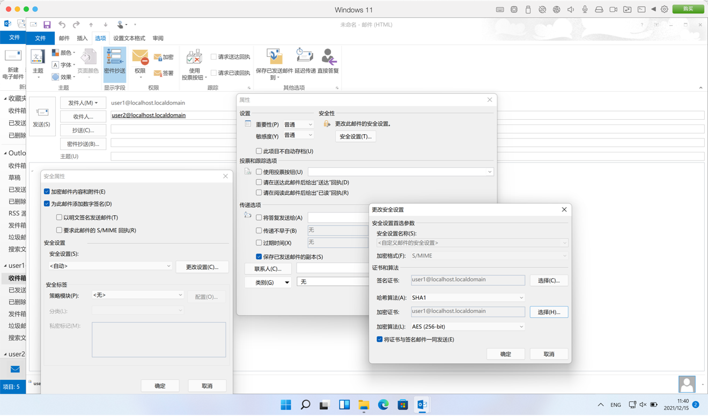
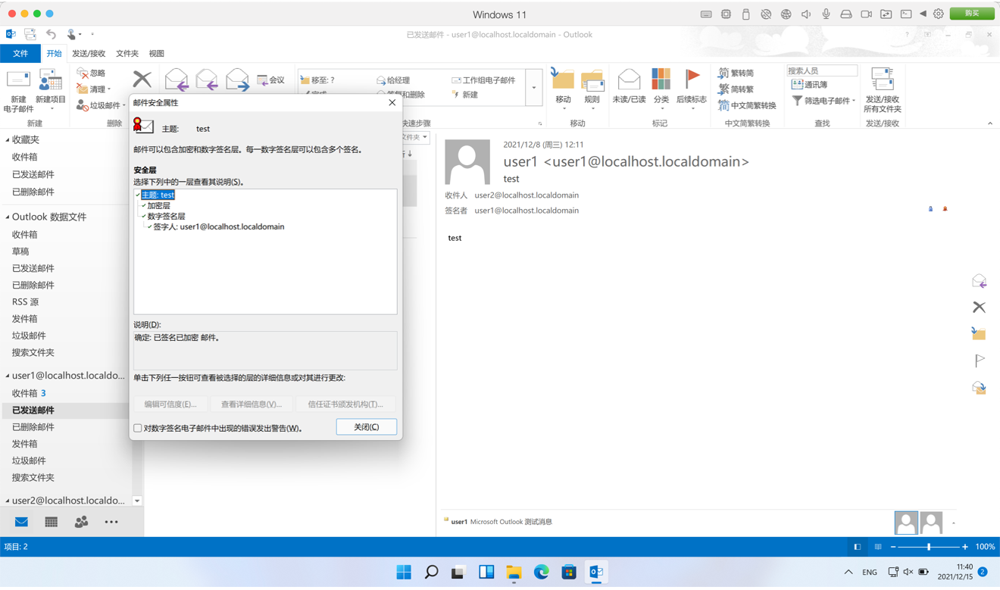

# Ex1

邮件加密发送和接收

## 1. 使用OpenSSL生成私钥、公钥

```bash
openssl genrsa -out priv.key
```

## 2. 使用OpenSSL生成CA证书

```bash
openssl req -new -x509 -key priv.key -out ca.crt
```

## 3. 通过CA申请收发邮件证书

```bash
openssl req -new -key priv.key -out send.pem
openssl req -new -key priv.key -out recv.pem
openssl x509 -req -in send.pem -CA ca.crt -CAkey priv.key -CAcreateserial -out send.cer
openssl x509 -req -in recv.pem -CA ca.crt -CAkey priv.key -CAcreateserial -out recv.cer
```

## 4. 导出pfx格式发件证书

```bash
openssl pkcs12 -export -clcerts -in send.crt -inkey priv.key -out send.pfx
```

## 5. 在Outlook登录发件账号



## 6. 添加收件联系人及其证书




## 7. 安装pfx证书及发送邮件





到这里，邮件的加密签名发送就完成了。
